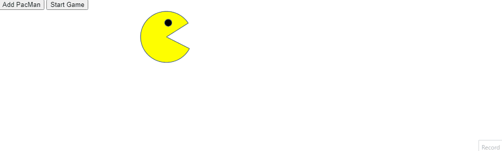

# PacMen Exercise

## Description
This project involves creating multiple PacMen that bounce around the screen. Each PacMan is created at a random position with a random velocity, and they change direction when they hit the edges of the screen.

## How to Run
1. Clone the repository: `git clone https://github.com/LucaBrizuela/PacmenExercise.git`
2. Open `index.html` in your web browser.

## Roadmap
- Add different shapes and colors for PacMen.
- Implement collision detection between PacMen.
- Click the "Add PacMan" button to create a PacMan, you can add as many as you want.
- Click the "Start Game" button to begin.

## License
This project is licensed under the MIT License. See the [LICENSE](https://github.com/LucaBrizuela/PacMenExercise/blob/main/LICENSE) file for details.

## Results

